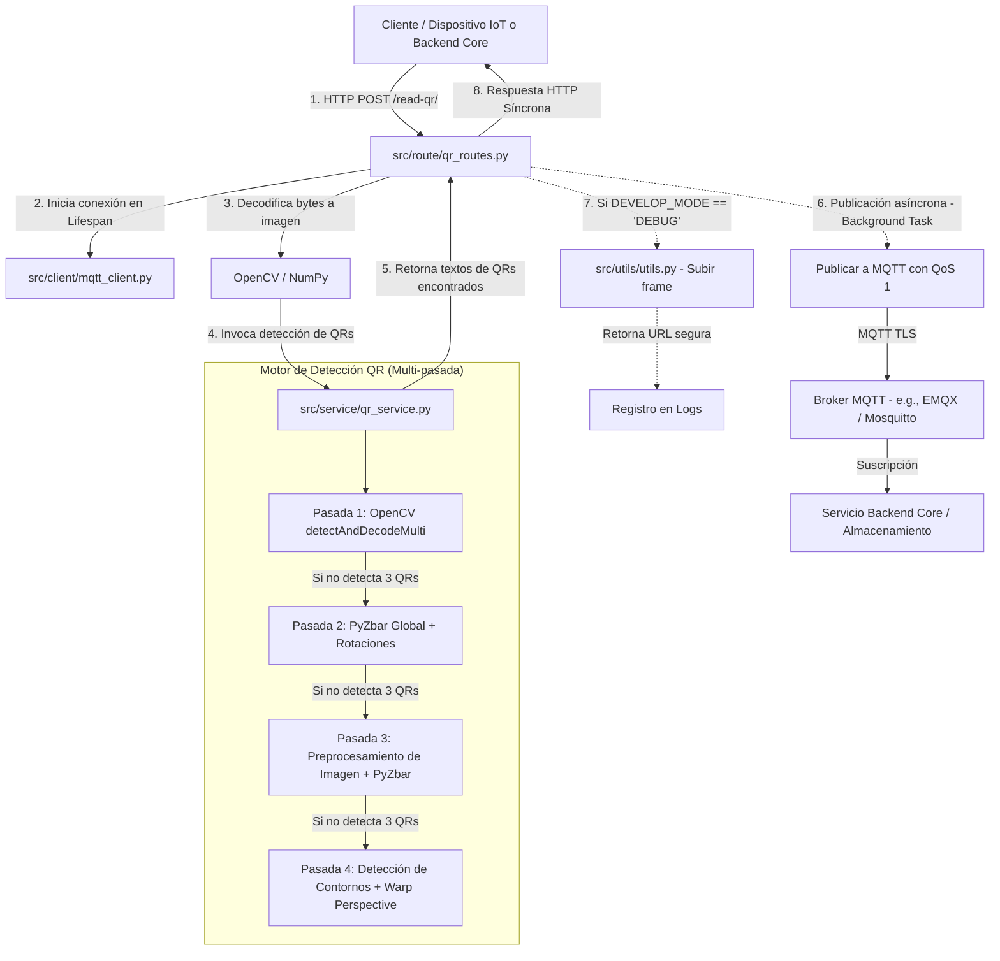

# QR-Reader-Server 🚀

Este repositorio contiene el microservicio **QR-Reader-Server**, encargado de la lectura y decodificación de múltiples códigos QR en imágenes. Está diseñado específicamente para integrarse en un ecosistema de Internet de las Cosas (IoT), ofreciendo un procesamiento de imágenes altamente robusto y una arquitectura orientada a eventos para la comunicación asíncrona entre servicios.

Desarrollado con **FastAPI** (Python), utiliza librerías avanzadas de visión computacional como **OpenCV** y **PyZbar** para lograr una tasa de éxito sumamente elevada en condiciones difíciles de captura (baja resolución, rotación y distorsión de perspectiva).

---

## 🛠️ Arquitectura del Sistema

El servidor opera como un microservicio desacoplado y sin estado (stateless). Su arquitectura y flujo de ejecución se detallan a continuación:

### Flujo de Datos y Componentes



### Motor de Detección de Códigos QR (4 Pasadas)

El algoritmo implementado en [src/service/qr_service.py](file:///c:/Users/eduar/Desktop/tesis/QR-Reader-Server/src/service/qr_service.py) busca maximizar la detección de códigos QR (hasta un objetivo de 3 códigos por imagen) a través de un proceso iterativo de descarte:

1. **Pasada 1: OpenCV Multi-Detector:** Utiliza la función nativa `detectAndDecodeMulti` de OpenCV para realizar una decodificación rápida y directa de múltiples códigos en el frame original.
2. **Pasada 2: PyZbar Global con Rotaciones:** Si no se alcanza el objetivo de lectura, se ejecuta PyZbar sobre la imagen original. Si falla, rota la imagen automáticamente a 90°, 180° y 270° buscando resolver problemas de orientación de cámara.
3. **Pasada 3: Preprocesamiento Global Avanzado:** En caso de lecturas incompletas, se aplica un pipeline de preprocesamiento de imagen:
   - Escalado agresivo (LANCZOS4 4x) para mejorar la definición de módulos QR pequeños.
   - Ecualización adaptativa de histograma (CLAHE) para contrastar el código sobre fondos oscuros o quemados.
   - Filtro bilateral para reducir ruido preservando bordes definidos.
   - Operaciones morfológicas de cierre para rellenar imperfecciones.
   - Umbralización adaptativa gaussiana (Adaptive Threshold).
4. **Pasada 4: Escaneo de Contornos y Warp Perspective:** Como último recurso, el algoritmo localiza contornos candidatos (polígonos de 4 lados con área > 1000px). Para cada candidato, aplica una transformación de perspectiva (warp) para proyectarlo como una imagen plana frontal de $700 \times 700$ píxeles, facilitando una decodificación limpia en ángulos extremos.

---

## 📡 Comunicación entre Servicios

El microservicio utiliza dos canales principales de comunicación:

### 1. Ingesta Síncrona (HTTP REST API)

El endpoint principal expuesto en [src/route/qr_routes.py](file:///c:/Users/eduar/Desktop/tesis/QR-Reader-Server/src/route/qr_routes.py) procesa las peticiones de subida de imágenes:

* **Endpoint:** `POST /read-qr/`
* **Formato del Cuerpo (multipart/form-data):**
  * `file`: Archivo de imagen binario (formatos comunes como JPEG, PNG, etc.).
  * `correlationId`: Identificador único de transacción (UUID) para trazabilidad en la arquitectura de microservicios.
  * `cameraCode`: Identificador físico de la cámara o estación que tomó la fotografía.
* **Respuesta HTTP (JSON):**
  ```json
  {
    "success": true,
    "results": [
      "VALOR_QR_1",
      "VALOR_QR_2"
    ]
  }
  ```

### 2. Notificación Asíncrona (MQTT con SSL/TLS)

Una vez obtenida la lectura de los códigos (exista o no detección), los resultados se publican de forma asíncrona mediante un hilo secundario (`FastAPI.BackgroundTasks`) para no retrasar la respuesta HTTP del cliente.

* **Cliente MQTT:** Administrado en [src/client/mqtt_client.py](file:///c:/Users/eduar/Desktop/tesis/QR-Reader-Server/src/client/mqtt_client.py) como un Singleton.
* **Ciclo de Vida:** Se conecta de forma automática al iniciar la aplicación mediante el callback `lifespan` en [src/main.py](file:///c:/Users/eduar/Desktop/tesis/QR-Reader-Server/src/main.py) y se desconecta de manera limpia en el apagado.
* **Configuración de Seguridad (TLS):** La comunicación requiere obligatoriamente una conexión segura SSL/TLS (`tls_set` habilitado con verificación de certificados).
* **Calidad de Servicio (QoS):** Se utiliza `qos=1` (al menos una entrega garantizada) para asegurar que el sistema receptor reciba la lectura.
* **Tópico de Destino:** Configurable mediante la variable de entorno `MQTT_TOPIC_RESULT`.
* **Payload Publicado (JSON):**
  ```json
  {
    "correlationId": "85f7a08b-e854-47c3-8f0a-115f231dfb19",
    "cameraCode": "CAM_ENTRADA_01",
    "results": [
      "VALOR_QR_1",
      "VALOR_QR_2"
    ],
    "found": true
  }
  ```

---

## ⚙️ Configuración y Variables de Entorno

El servidor se configura a través de variables de entorno definidas en un archivo `.env` en la raíz del proyecto. Puedes tomar como base el archivo [.env-example](file:///c:/Users/eduar/Desktop/tesis/QR-Reader-Server/.env-example).

| Variable | Descripción | Requerido | Ejemplo |
| :--- | :--- | :---: | :--- |
| `APP_NAME` | Nombre identificador del microservicio. | No | `QR-Reader-Server` |
| `PORT` | Puerto de escucha para la ejecución en local (sin Docker). | No | `8000` |
| `MQTT_SERVICE_URL` | Dirección del Broker MQTT (host o dominio). | **Sí** | `broker.hivemq.com` o `192.168.1.50` |
| `MQTT_SERVICE_PORT` | Puerto del Broker MQTT (debe soportar SSL/TLS). | **Sí** | `8883` o `1883` |
| `MQTT_SERVICE_USERNAME` | Usuario de autenticación del Broker MQTT. | No | `iot_client` |
| `MQTT_SERVICE_PASSWORD` | Contraseña del Broker MQTT. | No | `SecurePass123` |
| `MQTT_CLIENT_ID` | Client ID personalizado para la sesión MQTT. | No | `qr_reader_service_prod` |
| `MQTT_TOPIC_RESULT` | Tópico donde se publicarán los resultados procesados. | **Sí** | `tesis/qr/lecturas` |
| `DEVELOP_MODE` | Si se establece en `DEBUG`, habilita la subida del frame a Cloudinary. | No | `DEBUG` / `PRODUCTION` |
| `CLOUDINARY_CLOUD_NAME` | Nombre de la cuenta de Cloudinary (requerido si `DEVELOP_MODE=DEBUG`). | Condicional | `mi-cuenta-cloud` |
| `CLOUDINARY_API_KEY` | API Key de Cloudinary. | Condicional | `123456789012345` |
| `CLOUDINARY_API_SECRET`| API Secret de Cloudinary. | Condicional | `aBcDeFgHiJkLmNoPqRsTuVwXyZ` |

---

## 🚀 Instrucciones de Despliegue

Este proyecto puede ejecutarse directamente en el host (local) o empaquetado mediante contenedores con Docker, que es el método recomendado para entornos de producción.

### Opción A: Despliegue con Docker y Docker Compose (Recomendado)

Docker simplifica la instalación ya que la imagen base incluye todas las dependencias compartidas de C requeridas para el análisis de imágenes (como `libzbar0` y OpenCV).

#### Requisitos
* Docker instalado en el sistema.
* Docker Compose.

#### Pasos para el Despliegue

1. **Clonar e Ingresar al Proyecto:**
   ```bash
   cd QR-Reader-Server
   ```

2. **Configurar el Entorno:**
   Copia el archivo de plantilla y configúralo con tus credenciales de MQTT y Cloudinary:
   ```bash
   cp .env-example .env
   ```
   Edita las variables dentro del nuevo archivo `.env` según corresponda.

3. **Construir y Levantar el Contenedor:**
   Ejecuta el siguiente comando para levantar el servicio en segundo plano:
   ```bash
   docker-compose up -d --build
   ```
   *Esto construirá la imagen descrita en el [Dockerfile](file:///c:/Users/eduar/Desktop/tesis/QR-Reader-Server/Dockerfile) utilizando Python 3.11 Slim, instalará las librerías nativas `libzbar0` y `ffmpeg`, e instalará las dependencias en [requirements.txt](file:///c:/Users/eduar/Desktop/tesis/QR-Reader-Server/requirements.txt).*

4. **Verificar el Estado de la Aplicación:**
   ```bash
   docker-compose ps
   docker-compose logs -f
   ```

---

### Opción B: Despliegue Local (Entorno de Desarrollo)

Si deseas ejecutar el microservicio directamente en tu máquina local sin Docker, debes instalar las dependencias nativas del sistema.

#### Requisitos Previos

* **Python 3.11** o superior instalado.
* **Librería del Sistema ZBar:**
  * **Ubuntu/Debian:**
    ```bash
    sudo apt-get update
    sudo apt-get install -y libzbar0
    ```
  * **macOS (Homebrew):**
    ```bash
    brew install zbar
    ```
  * **Windows:**
    Descarga e instala el binario ejecutable de ZBar para Windows. Asegúrate de añadir el directorio `/bin` de Zbar a la variable de entorno `PATH` del sistema para que `pyzbar` pueda localizar las DLLs.

#### Pasos para la Instalación

1. **Crear y activar un entorno virtual:**
   ```bash
   python -m venv .venv
   
   # En Windows (PowerShell):
   .\.venv\Scripts\Activate.ps1
   
   # En Linux/macOS:
   source .venv/bin/activate
   ```

2. **Instalar dependencias de Python:**
   ```bash
   pip install --upgrade pip
   pip install -r requirements.txt
   ```

3. **Configurar el archivo `.env`:**
   Crea y edita tu archivo `.env` en la raíz del proyecto.

4. **Iniciar el servidor local con Uvicorn:**
   ```bash
   uvicorn src.main:app --host 0.0.0.0 --port 8000 --reload
   ```

---

## 🧪 Pruebas y Uso del Servicio

Una vez que el servidor está levantado (en el puerto 8000 por defecto), puedes enviar peticiones REST.

### Enviar una petición mediante `curl`

Ejecuta el siguiente comando para enviar una imagen de prueba:

```bash
curl -X POST "http://localhost:8000/read-qr/" \
  -F "file=@/ruta/de/tu/imagen_con_qrs.jpg" \
  -F "correlationId=uuid-prueba-12345" \
  -F "cameraCode=CAM_ACCESO_01"
```

### Respuesta Exitosa Esperada

```json
{
  "success": true,
  "results": [
    "http://enlace-decodificado-del-codigo-qr.com/id=99",
    "TICKET_ID_77812"
  ]
}
```

### Flujo de Depuración y Cloudinary

Si la variable `DEVELOP_MODE` está establecida en `DEBUG` en tu archivo `.env`, el servidor realizará el siguiente flujo extra controlado por [src/utils/utils.py](file:///c:/Users/eduar/Desktop/tesis/QR-Reader-Server/src/utils/utils.py):
1. Escribe la imagen original temporalmente en `/tmp/debug_frame.jpg`.
2. Sube la imagen a Cloudinary en la carpeta `opencv-debug/` asignándole un identificador estructurado: `opencv-debug/CAM_ACCESO_01/uuid-prueba-12345`.
3. Devuelve la URL pública y segura (`https://res.cloudinary.com/...`) y la registra en los logs del servidor para facilitar su inspección visual remota.
